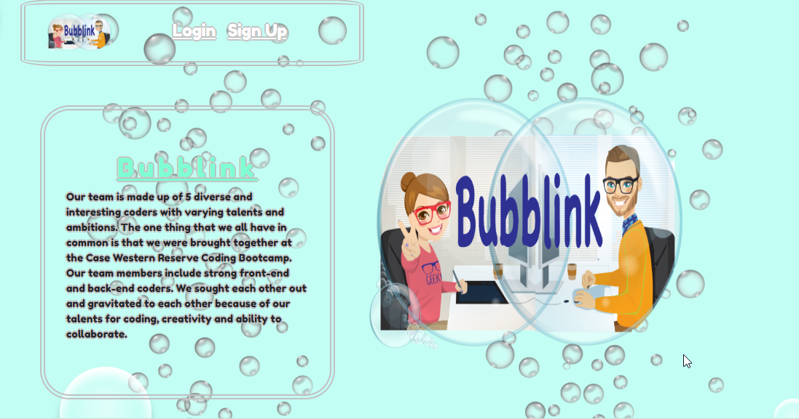
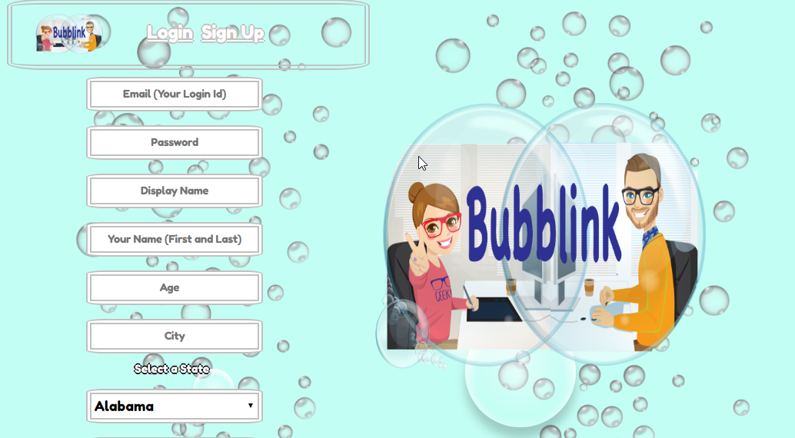
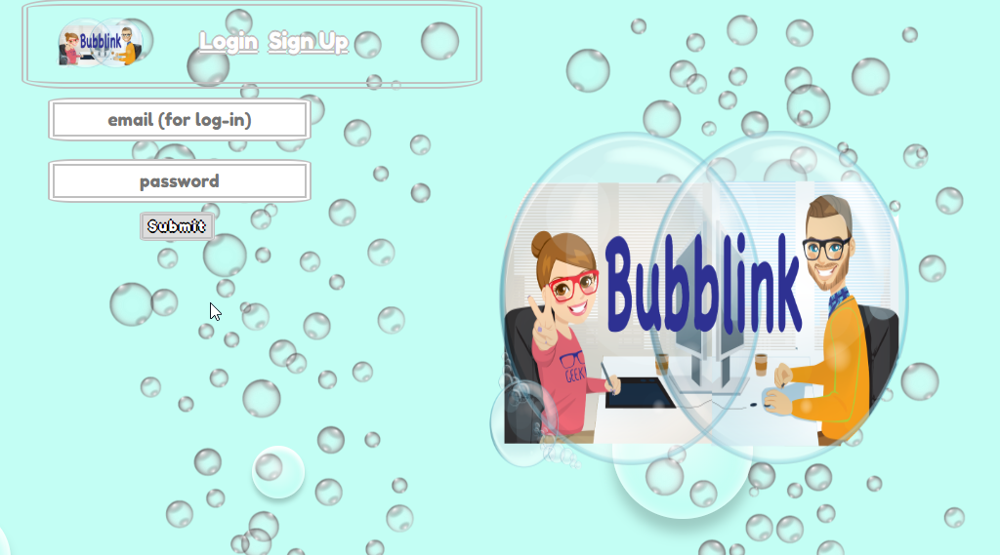
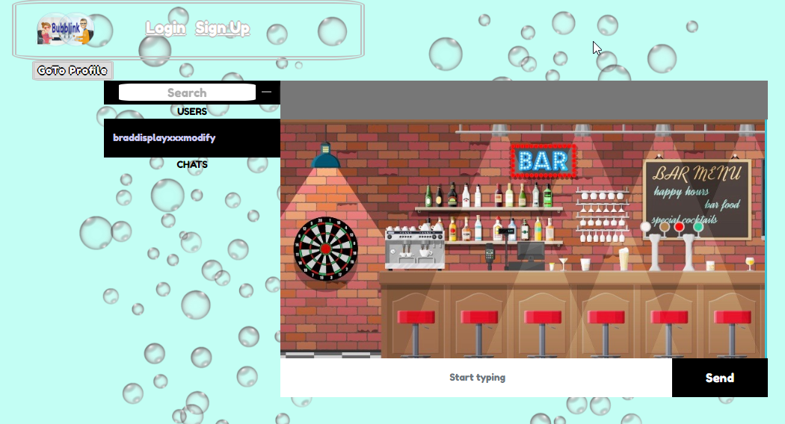
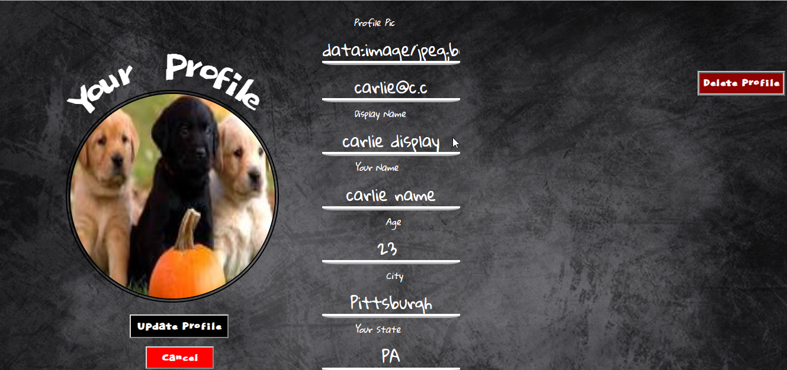

# BubbLink React App

Project 3 - CWRU Full-Stack Web Development Bootcamp
October 2018

Daniel Kelley, Brad Hersey, Joe Wancho, Melinda Russell, Rhonda Johnson

## "Home" Page
 Home page - overview of developers of app

## Overview

Bubblink is an app that allows users to develop relationships with others from the comfort of their own home.

# Link to deployed project

[Click here](https://bubblink.herokuapp.com/) to view the deployed version.

# Link to GitHub

https://github.com/rmxjohnson/VirtualChat.git

## Technologies used:
* ReactJS
* NodeJS
* Express
* MongoDB/Mongoose
* CSS3 including CSS grid
* HTML5

* Node Packages:
  * axios
  * body-parser
  * bcryptjs
  * concurrently
  * express
  * mongoose
  * react
  * react-bootstrap
  * react-dom
  * react-select-us-states
  * socket.io
  * uuid 

## "SignUp" Page
## New Users must sign up for an account

## "Login" Page
## Or returning users can simply log in

## "Community Chat" Page
## Once logged in, users are redirected to the community chat page

## "Profile" Page
## User can also modify their profile or delete their profile from the app

# Additional Information

The app was created by the Developer team of Bradley Hersey, Rhonda Johnson, Melinda Russell, Daniel Kelly and Joseph Wancho

Bubblink is an interactive app for meeting new people by chatting online in virtual chat rooms from the comfort of their own home. The User is able to create their profile to meet other individuals with similar likes and interests. 
The app enables Users to participate in group or date chats.  

Melinda Russell created the “Bubblelink” logo for this app using Adobe Illustrator. 

This application uses a variety of applications, including HTML, CSS, MongoDB, Heroku, JS, jQuery, Bootstrap, Node, SocketManager and React among others specified below.

Module Exports are employed to pull various data that can be used in the User profile. 

This Project was bootstrapped with Create React App.

This Project used react-scripts, a development dependency.

All images that were used for this Project are in jpg or png format.

The following folders located in Components were created using both CSS and JS: AboutUs, BigLogo, BubbleFun, Home, Layout, Login, Navbar, Navbar2, Profile, and Signup. The following folders located in Components were created using only JS: Chats, Datexx, Messages and Sidebars.  

